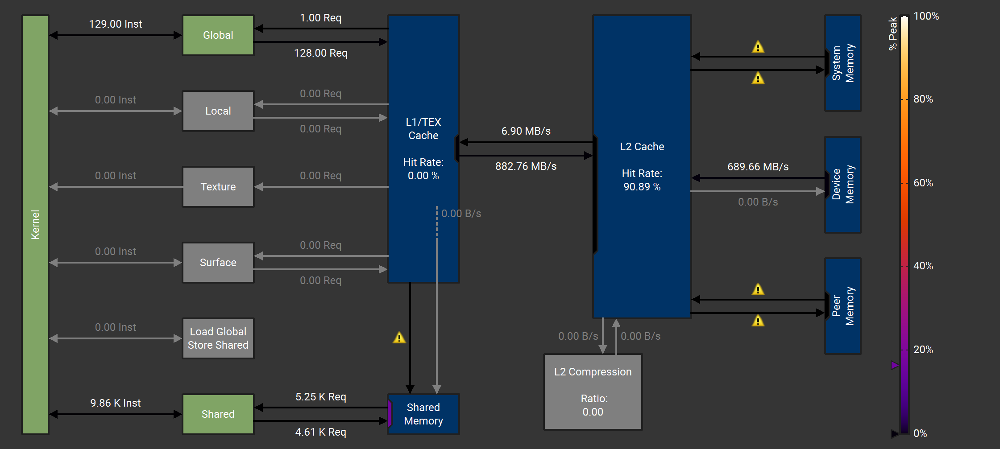

# transformer

Caltech CS179 Transformer Project

# Background

I recommend you read [Attention Is All You Need](https://arxiv.org/abs/1706.03762) many times, this paper is critical to all transformer models.

We will be implementing the [Qwen2](https://arxiv.org/pdf/2407.10671) model, an open-weights LLMs.
Qwen2's architecture is copied from [Meta's Llama](https://arxiv.org/abs/2407.21783), except Qwen2 uses bias in the QKV matrices.
Both of these architectures implement [grouped-query attention](https://arxiv.org/abs/2305.13245),
[layer normalization](https://arxiv.org/abs/1607.06450v1) with zero mean,
[SwiGLU feed forward networks](https://arxiv.org/abs/2002.05202), and
[rotary positional embeddings](https://arxiv.org/abs/2104.09864).

# Implementation

We will only implement autoregressive decoding, which supports inference (generation) with one token at a time.
With single-token decoding, we avoid the masked attention operator which is the focus of most transformer optimization such as [FlashAttention](https://arxiv.org/pdf/2205.14135).
Additionally, we will not support batching.

We will use the [`bfloat16`](https://en.wikipedia.org/wiki/Bfloat16_floating-point_format) data type to store
model weights and key/value cache to reduce memory bandwidth relative to `float32`. However,
internally, we will use `float32` for accumulation within kernels, to minimize unnecessary floating-point rounding errors.

For simplicity, all tensors in this implementation will use row-major ordering, i.e. the memory is contiguous along the last dimension.
However, this layout is not optimal for performance is all cases.

# Real world LLM inference

This project is missing many features in real-world production LLM inference, such as:
- Batching
- Prefill phase with masked matrix multiply
- Tensor cores
- Quantization
- Advanced model architectures, such as Mixture-of-Experts (MoE)
- Multi-GPU and multi-node parallelization
- KV cache offloading
- Sampling methods, such as Top-K

# Assignment
You will implement all kernels necessary for the LLM. Libraries are not allowed (such as cuBLAS, CUTLASS, cub, and thrust),
you must code all kernels from scratch.

## Part 1 (first week)

For the questions, cite sources you used. To submit, zip your repository to `~/lab5_2025_submission.zip`.

### Question 1.1 (5 points)
In this assignment, we will not be using tensor cores, because they require advanced data transfer layouts.
Instead, we will implement matrix-vector multiply with standard fused-multiply-add operators.
What is ratio of BF16 tensor core FLOPS to BF16 non-tensor core FLOPS on an A100-PCIE-40GB GPU?
Note: NVIDIA and AMD marketing both try to inflate their performance by measuring "sparse" tensor core operations, but nobody uses those.

According to the documentation, the A100-PCIE-40GB GPU gets 312 BF16 tensor core TLOPS vs. 78 BF16 non-tensor core FLOPS. This ratio is 4:1. 

### Question 1.2 (5 points)
What is the expected speedup of tensor cores vs non-tensor cores for matrix-vector multiplication on an A100-PCIE-40GB GPU?
Make an argument based on arithmetic intensity (FLOPS is not the whole story).
Assume the matrix and vector are read from off-chip memory.

Because matrix-vector multiplication is memory-limited, we should not expect a x4 speedup despite the 4 times greater FLOPS. In reality, the arithmetic intensity of matrix-vector multiplication is very low so we can expect a <2 times speedup. 

### Coding (80 points)
Implement GPU operators:
- ArgMax
- LayerNorm
- MatrixVectorMultiply
- RoPE
- SiLUMult

### Profiling (10 points)
Profile all your kernels with `ncu`, with input sizes matching what you'd expect for Qwen2 0.5B.
For each kernel, provide a screenshot and explain something interesting you noticed.
For example:
- Explain why your kernel is memory-bandwidth limited, latency/occupancy-limited, compute-limited, or limited by some other overhead.
- Explain why your kernel has suboptimal memory accesses, and a potential strategy to improve the kernel with expected performance increase.
- Explain which kernels are the most important to optimize, and which ones are less important.
- Explain how the performance would be different in another scenario (e.g. longer sequence length, larger model, increased batch size)
- Explain similarities across the kernels

Argmax:

The argmax function is not memory limited or compute limited, as the memory access is much lower than maximum throughput and the compute usage is much less than max. Because this kernel is so fast, it is not as important to optimize for our final model.


Layernorm:

This kernel is also not memory or compute limited, as it features very low usage of both. 

RoPE: 

Because we calculate the cos and sin at each element, the alu usage in this kernel is relatively high. However, it is still not compute limited, meaning this is the correct method. 

MatrixVectorMultiply:

This function is largely memory limited, as it must read in every value in the matrix. Because the runtime of this kernel is much higher than others and matrix-vector multiplications are so common in the architecture, this kernel is a higher priority to optimize. 


SiluMult:

Similarly to the RoPE kernel, this kernel uses more of the alu to calculate the exponent but ends up ebing memory limited anyway. 

## Part 2 (second week)

To submit, zip your repository to `~/lab6_2025_submission.zip`.

### Question 2.1 (3 points)
List all the matrix-vector multiplies in a Qwen2 0.5B layer, including the (M, K) dimensions of the matrix.
(Do not include grouped-query attention).


Q projection: (896, 896)

K projection: (128, 896)

V projection: (128, 896)

Output projection: (896, 896)

Gate projection: (4864, 896)

Up projection: (4864, 896)

Down projection: (896, 4864)

### Question 2.2 (2 points)
Treating each query head as a row of a matrix, what are the dimensions of the matrix-matrix multiply in a
Qwen2 0.5B layer grouped-query attention operation? Assume current sequence length is 1234 tokens.

The dimensions are (1234, 64) x (64, 14).

### Question 2.3 (5 points)
Assuming off-chip memory bandwidth is the limiting factor, what is the theoretical minimum inference latency (in ms)
for Qwen2 0.5B on an A100-PCIE-40GB, with BF16 weights? Assume small sequence length (i.e. KV cache size is negligible).


The off-chip memory bandwidth on a A100-PCIE-40GB is 1.6 TB/s. Adding up the sizes of all of the matrices that will be multiplied per layer, we get that we have to transfer 14909440 BF16 weights for a total of 29818880 bytes per layer. Additionally, we must transfer the embedding weights which contains (896 * 151936) BF16s for a total of 272269312 bytes. This will take a total of 0.6174 ms per inference. 


### Question 2.4 (5 points)
Determine the sequence length at which the KV cache becomes non-negligible in terms of performance;
specifically, at what sequence length in Qwen2 0.5B would the KV cache become 10% the size of the model parameters?


The model parameters are a total of 302088192 bytes, and with 128 values per key and value for each of 24 layers we have 6144 bytes per sequence element. This means our sequence would have to be 4916 tokens long to be 10% of the parameters. 


### Coding (75 points)
Complete:
- GroupQueryAttention
  - Must use online numerically stable softmax, see section 3.1 of [Online normalizer calculation for softmax](https://arxiv.org/pdf/1805.02867)
- Qwen2Layer
- Qwen2Model

You should not allocate or free any memory inside `Qwen2Model::forward`;
scratch space should be allocated only at model initialization, in constructors.

Test by running `./transformer`, and 100 tokens will be produced, matching the python reference implementation 

Once working, you can run `./transformer --interactive --max-seq-len 10000` to send messages with a chatbot interface.

### Profiling (10 points)

Once working, profile your implementation with:
```bash
ncu --set full --nvtx --nvtx-include last_token/ -c100 -o profile ./transformer
```
(may adjust -c parameter to number of kernels per layer)

How many microseconds per layer does your implementation take?
What is the slowest part of the layer and why?
Include screenshots of the something interesting you notice, and explain.


Attention: 


Softmax:


This implementation takes 0.73 ms per layer. The slowest components are the matrix-vector multiplications, as they are very memory limited and have to transfer all of their memory at each step. 

I find it interesting that the GQA and softmax operations have high compute utilization, which is very unlike the other kernels. This is likely due to the short sequence length for the test. 


## Assignment notes

- Your kernels must fully occupy the GPU when possible (i.e. do not launch with only 1 block, launch with many).
- Kernels should have optimal memory access (coalesced gmem, and no smem bank conflicts) when possible.
- Always use CUDA streams when launching kernels, such as:
  - `my_kernel<<<grid_dim, block_dim, 0, stream>>>(my_arg);`
- Use the test cases and python reference to check the correctness of your implementation.

## Debugging tips

- Add print statements in the python implementation and equivalents in the CUDA implementation, such as:
```python
print('after q proj:', queries[0, 0])
```
corresponding to
```c++
std::cerr << "after q proj: " << static_cast<float>(*static_cast<__nv_bfloat16*>(queries->data)) << std::endl;
```
and check when they diverge.

- All GPU memory is allocated with `cudaMallocManaged`, which allows you to access the GPU memory from the CPU.
  Therefore, with plain GDB, we can run:
  - `CUDA_LAUNCH_BLOCKING=1 gdb ./transformer`
  - Set breakpoints
  - Save a tensor to disk: `dump binary memory /tmp/queries.bin queries->data ((uint8_t*)queries->data)+queries->size`
  - Load the tensor in python: `torch.from_file('/tmp/queries.bin',size=head_size*num_query_heads,dtype=torch.bfloat16).reshape(num_query_heads, head_size)`

## Test cases
Run all test cases with:
- `cd build`
- `cmake --build .`
- `ctest`

For tests that are failing, you can run them individually to see which elements were incorrect, for example:
- `cd build`
- `cmake --build .`
- `./silumulttest`

Failing output:
```
difference at index 0: GPU calculated 10.875, CPU calculated 108.5
difference at index 1: GPU calculated -5.65625, CPU calculated 0.332031
difference at index 2: GPU calculated 7.3125, CPU calculated -76.5
...
```

Also, note that passing all test cases does not mean you will get an A.
The test cases only check for correctness, not for performance.
If your kernels have needless suboptimal memory access, poor occupancy, or other performance issues,
the tests will still pass, but you will not get a good grade.

## Author
Sam Foxman 2025
